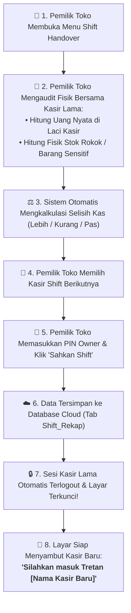
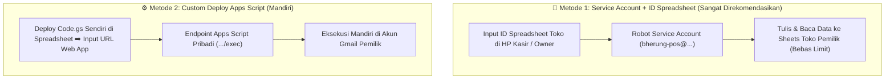

# 📖 Dokumentasi Arsitektur Cloud, Kuota & Manajemen Role Bherung POS

Dokumen ini menjelaskan secara menyeluruh tentang arsitektur sistem, pembagian kuota Google, sistem autentikasi PIN & Role, serta alur operasional serah terima shift pada aplikasi kasir **Bherung POS**.

---

## 📑 Daftar Isi
1. [Arsitektur Autentikasi PIN & Manajemen Role](#1-arsitektur-autentikasi-pin--manajemen-role)
2. [Alur Operasional Serah Terima Shift & Audit Fisik](#2-alur-operasional-serah-terima-shift--audit-fisik)
3. [3 Metode Koneksi Database Cloud](#3-3-metode-koneksi-database-cloud)
4. [Rincian & Analisis Penggunaan Kuota](#4-rincian--analisis-penggunaan-kuota)
5. [Panduan Deploy Google Apps Script Mandiri](#5-panduan-deploy-google-apps-script-mandiri)

---

## 1. Arsitektur Autentikasi PIN & Manajemen Role

Bherung POS menggunakan autentikasi **4-Digit PIN** yang otomatis mendeteksi peran pengguna saat angka PIN selesai dimasukkan.

### 👥 Hierarki Role & Hak Akses

| Role | Default PIN | Hak Akses & Wewenang | Batasan |
| :--- | :---: | :--- | :--- |
| 👑 **Pemilik Toko (Owner)** | `1234` | • Akses Penuh ke Semua Fitur • Kelola & Tambah/Hapus Pengguna & PIN • Mengesahkan Serah Terima Shift & Audit Kas • Akses Pengaturan Toko & Hubungkan Database • Keluar/Logout Sesi Pemilik kapan saja | Tidak ada batasan. |
| 💼 **Penjaga Toko (Staff / Kasir)** | `5678` | • Transaksi Penjualan Cepat & Scan Barcode • Penerimaan Kasbon & Pembayaran Piutang • Cek Stok & Tambah Produk Baru (*Restock*) • Kunci Layar POS saat meninggalkan meja | 🚫 **Dilarang**: Tidak bisa melihat atau membuka menu Serah Terima Shift, dan dilarang mengedit pengguna/PIN lain. |

### 🔒 Fitur Kunci & Sambutan Layar (PinLoginLockScreen)
* **Sambutan Khas Madura**: Ketika layar terkunci, sistem menampilkan salam personalisasi kepada kasir shift berikutnya:
  > *"Silahkan masuk Tretan [Nama Penjaga Toko]"*
* **Tombol Keluar Akun Pemilik (Owner Logout)**:
  Saat Pemilik Toko selesai mengecek laporan di HP toko, Owner cukup menekan tombol **"Keluar Akun Pemilik Toko"** di bilah atas atau menu drawer. Sesi langsung terkunci kembali dan menyambut kasir yang sedang bertugas.

---

## 2. Alur Operasional Serah Terima Shift & Audit Fisik

Untuk toko kelontong/sembako yang beroperasi 24 jam non-stop, proses pergantian penjaga toko dirancang transparan agar tidak terjadi kecurangan kas laci maupun selisih barang berharga:

---

## 3. Metode Koneksi Database Cloud (Bebas Limit 100 User & 100% Unlimited)

Bherung POS menggunakan arsitektur koneksi cloud yang **bebas dari batas 100 user Google OAuth** dan tidak memerlukan verifikasi rumit:

### Ringkasan Perbandingan Metode

| No | Metode | Cara Kerja | Siapa yang Memakai? | Kelebihan |
| :---: | :--- | :--- | :--- | :--- |
| **1** | **Service Account + ID Spreadsheet** *(Paling Direkomendasikan)* | Service Account robot membaca & menulis spreadsheet secara otomatis | HP Pemilik & HP Kasir di Meja Kasir | 🟢 **UNLIMITED User**, sangat aman (kasir tidak perlu tahu email Google Owner), 100% tanpa limit 100 user. |
| **2** | **Custom Deploy Apps Script** | Deploy `Code.gs` mandiri dan masukkan URL Web App pribadi | Pemilik Toko Tingkat Lanjut | 🟢 **UNLIMITED User**, 100% independen di bawah kendali script Google Drive sendiri. |
| **3** | **Mode Offline 100% (Cadangan)** | Penyimpanan lokal SQLite & SharedPreferences | Kondisi tanpa internet / darurat | Transaksi kasir tetap berjalan normal tanpa gangguan saat internet mati. |

---

## 4. Rincian & Analisis Penggunaan Kuota

Banyak pengguna bertanya: *"Jika memakai Google Service Account + ID Spreadsheet atau Apps Script, kuota siapa yang terpakai?"*

### 📊 Tabel Pembagian Kuota Resmi Google

| Komponen | Milik Siapa yang Digunakan? | Batas Kuota Gratis Google | Kebutuhan Toko 24 Jam | Status |
| :--- | :--- | :--- | :--- | :--- |
| **Penyimpanan Database (Google Drive)** | 👤 **Akun Google Pemilik Toko** | 15 GB Gratis per akun | File Spreadsheet hanya **1 - 10 MB** untuk puluhan ribu transaksi | 🟢 **Hanya terpakai < 0.1%** |
| **Request API (Google Sheets API)** | 🤖 **Google Cloud Service Account** | 300 request / menit | Transaksi kasir rata-rata beberapa detik sekali | 🟢 **Sangat Melimpah** |
| **Waktu Eksekusi Apps Script** | 👤 **Akun Gmail Pemilik** *(jika pakai Metode 3)* | 90 Menit / hari (Gratis) | 1 transaksi = ~0.3 detik (90 menit = ~18.000 transaksi/hari) | 🟢 **Hanya terpakai < 5%** |
| **Panggilan URL Fetch Apps Script** | 👤 **Akun Gmail Pemilik** *(jika pakai Metode 3)* | 20.000 panggilan / hari | Rata-rata toko memproses 200 - 1.000 transaksi/hari | 🟢 **Sangat Aman** |

> [!TIP]
> **Privasi & Keamanan Terjamin**: Data keuangan, katalog harga, dan catatan kasbon tetap 100% berada di dalam akun Google Drive Pemilik Toko.

---

## 5. Panduan Deploy Google Apps Script Mandiri

Jika Anda memilih **Metode 3 (Custom Deploy)**, ikuti 6 langkah mudah berikut:

1. **Buka Google Spreadsheet Toko Anda**:
   Buka file spreadsheet di browser komputer/laptop ➡️ Klik menu **Extensions (Ekstensi)** ➡️ Pilih **Apps Script**.
2. **Salin Kode Backend**:
   Hapus semua teks bawaan, lalu salin dan tempelkan seluruh isi file [google_apps_script/Code.gs](file:///media/rasyiqi/7653717A1C07B131/Bherung/google_apps_script/Code.gs).
3. **Mulai Penerapan (Deploy)**:
   Klik tombol biru **Deploy (Terapkan)** di pojok kanan atas ➡️ Pilih **New deployment (Penerapan baru)**.
4. **Atur Konfigurasi Web App**:
   Klik ikon gerigi ⚙️ di samping *Select type* ➡️ Pilih **Web app**:
   * **Description**: `Bherung POS Backend`
   * **Execute as**: `Me (emailAnda@gmail.com)`
   * **Who has access**: `Anyone (Siapa saja)` ⚠️ *(Wajib agar HP kasir bisa mengirim data transaksi tanpa login)*.
5. **Otorisasi & Dapatkan URL**:
   Klik **Deploy** ➡️ Berikan izin otorisasi (*Authorize access ➡️ Advanced ➡️ Go to Bherung Script*) ➡️ Salin **Web App URL** (yang berakhiran `/exec`).
6. **Tempelkan ke Aplikasi POS**:
   Buka menu **Pengaturan** di aplikasi Bherung POS ➡️ Tab **Database & Cloud** ➡️ Tempelkan ke kolom **URL Web App Google Apps Script** ➡️ Klik **Hubungkan & Simpan Database**.
